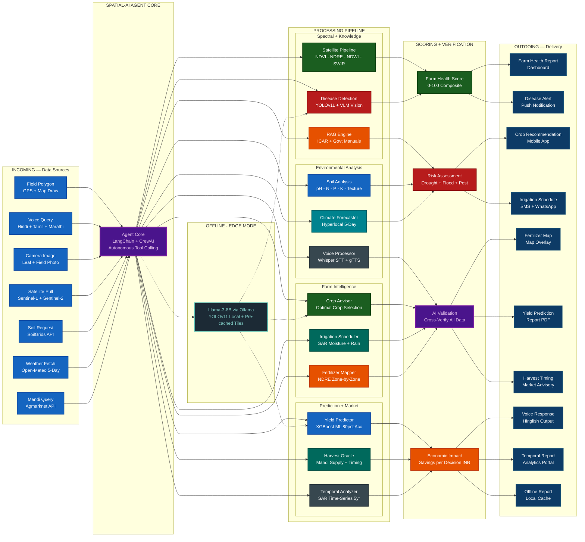

```mermaid
graph LR

%% ── CLASS DEFINITIONS ──────────────────────────────────────────
classDef ingestion  fill:#1565c0,stroke:#0D47A1,color:#fff,stroke-width:2px
classDef core       fill:#4a148c,stroke:#7B1FA2,color:#e1bee7,stroke-width:3px
classDef processing fill:#1b5e20,stroke:#0a3d0a,color:#fff,stroke-width:2px
classDef disease    fill:#b71c1c,stroke:#7f0000,color:#fff,stroke-width:2px
classDef climate    fill:#00838f,stroke:#006064,color:#fff,stroke-width:2px
classDef market     fill:#00695c,stroke:#004D40,color:#fff,stroke-width:2px
classDef rag        fill:#e65100,stroke:#BF360C,color:#fff,stroke-width:2px
classDef scoring    fill:#37474f,stroke:#263238,color:#fff,stroke-width:2px
classDef output     fill:#0d3b66,stroke:#1a5276,color:#fff,stroke-width:2px
classDef offline    fill:#1c2a35,stroke:#4db6ac,color:#80cbc4,stroke-width:2px

%% ── SUBGRAPH: INGESTION ────────────────────────────────────────
subgraph ING["INCOMING — Data Sources"]
    IN1["Field Polygon\nGPS + Map Draw"]
    IN2["Voice Query\nHindi + Tamil + Marathi"]
    IN3["Camera Image\nLeaf + Field Photo"]
    IN4["Satellite Pull\nSentinel-1 + Sentinel-2"]
    IN5["Soil Request\nSoilGrids API"]
    IN6["Weather Fetch\nOpen-Meteo 5-Day"]
    IN7["Mandi Query\nAgmarknet API"]
end

%% ── SUBGRAPH: CORE ─────────────────────────────────────────────
subgraph CORE["SPATIAL-AI AGENT CORE"]
    AC["Agent Core\nLangChain + CrewAI\nAutonomous Tool Calling"]
end

%% ── SUBGRAPH: PROCESSING ───────────────────────────────────────
subgraph PROC["PROCESSING PIPELINE"]
    subgraph ROW1["Spectral + Knowledge"]
        P1["Satellite Pipeline\nNDVI - NDRE - NDWI - SWIR"]
        P2["Disease Detection\nYOLOv11 + VLM Vision"]
        P3["RAG Engine\nICAR + Govt Manuals"]
    end
    subgraph ROW2["Environmental Analysis"]
        P4["Soil Analysis\npH - N - P - K - Texture"]
        P5["Climate Forecaster\nHyperlocal 5-Day"]
        P6["Voice Processor\nWhisper STT + gTTS"]
    end
    subgraph ROW3["Farm Intelligence"]
        P7["Crop Advisor\nOptimal Crop Selection"]
        P8["Irrigation Scheduler\nSAR Moisture + Rain"]
        P9["Fertilizer Mapper\nNDRE Zone-by-Zone"]
    end
    subgraph ROW4["Prediction + Market"]
        P10["Yield Predictor\nXGBoost ML 80pct Acc"]
        P11["Harvest Oracle\nMandi Supply + Timing"]
        P12["Temporal Analyzer\nSAR Time-Series 5yr"]
    end
end

%% ── SUBGRAPH: SCORING ──────────────────────────────────────────
subgraph SCORE["SCORING + VERIFICATION"]
    S1["Farm Health Score\n0-100 Composite"]
    S2["Risk Assessment\nDrought + Flood + Pest"]
    S3["AI Validation\nCross-Verify All Data"]
    S4["Economic Impact\nSavings per Decision INR"]
end

%% ── SUBGRAPH: OUTGOING ─────────────────────────────────────────
subgraph OUT["OUTGOING — Delivery"]
    O1["Farm Health Report\nDashboard"]
    O2["Disease Alert\nPush Notification"]
    O3["Crop Recommendation\nMobile App"]
    O4["Irrigation Schedule\nSMS + WhatsApp"]
    O5["Fertilizer Map\nMap Overlay"]
    O6["Yield Prediction\nReport PDF"]
    O7["Harvest Timing\nMarket Advisory"]
    O8["Voice Response\nHinglish Output"]
    O9["Temporal Report\nAnalytics Portal"]
    O10["Offline Report\nLocal Cache"]
end

%% ── SUBGRAPH: OFFLINE ──────────────────────────────────────────
subgraph EDGE["OFFLINE - EDGE MODE"]
    OFL["Llama-3-8B via Ollama\nYOLOv11 Local + Pre-cached Tiles"]
end

%% ── CONNECTIONS: Ingestion to Core ────────────────────────────
IN1 --> AC
IN2 --> AC
IN3 --> AC
IN4 --> AC
IN5 --> AC
IN6 --> AC
IN7 --> AC

%% ── CONNECTIONS: Core to Processing ───────────────────────────
AC --> P1
AC --> P2
AC --> P3
AC --> P4
AC --> P5
AC --> P6
AC --> P7
AC --> P8
AC --> P9
AC --> P10
AC --> P11
AC --> P12

%% ── CONNECTIONS: Processing to Scoring ────────────────────────
P1 --> S1
P2 --> S1
P3 --> S2
P4 --> S2
P5 --> S2
P6 --> S3
P7 --> S3
P8 --> S3
P9 --> S3
P10 --> S4
P11 --> S4
P12 --> S4

%% ── CONNECTIONS: Scoring to Outgoing ──────────────────────────
S1 --> O1
S1 --> O2
S2 --> O3
S2 --> O4
S3 --> O5
S3 --> O6
S3 --> O7
S4 --> O8
S4 --> O9
S4 --> O10

%% ── CONNECTIONS: Offline Fallback ─────────────────────────────
AC -.-> OFL
OFL -.-> P2
OFL -.-> P7
OFL -.-> P10

%% ── APPLY STYLES ───────────────────────────────────────────────
class IN1,IN2,IN3,IN4,IN5,IN6,IN7 ingestion
class AC core
class P1,P7 processing
class P2 disease
class P4,P10 ingestion
class P5 climate
class P3,P9 rag
class P6 scoring
class P8,P11 market
class P12 scoring
class S1 processing
class S2 disease
class S3 core
class S4 rag
class O1,O2,O3,O4,O5,O6,O7,O8,O9,O10 output
class OFL offline
```
